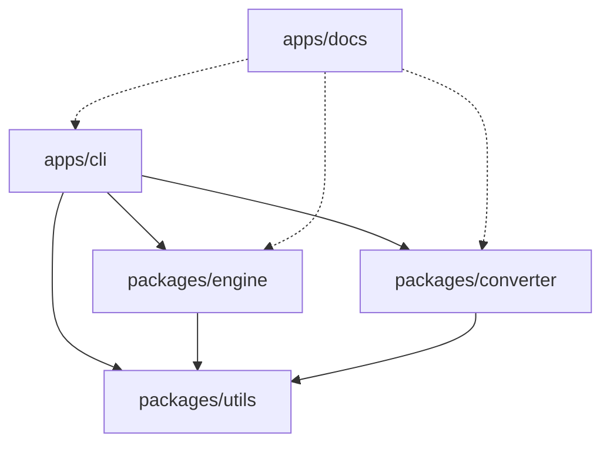
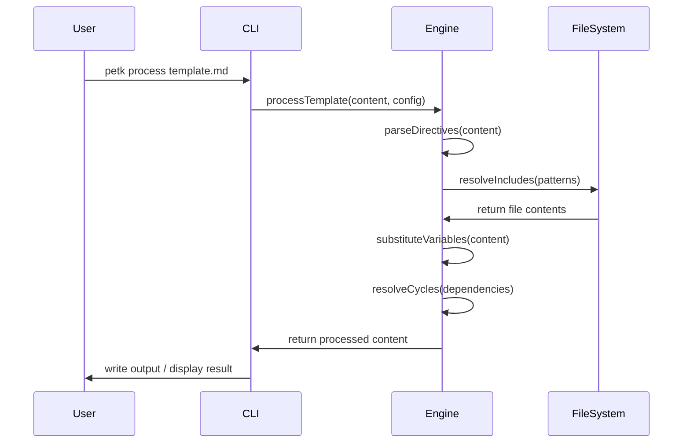
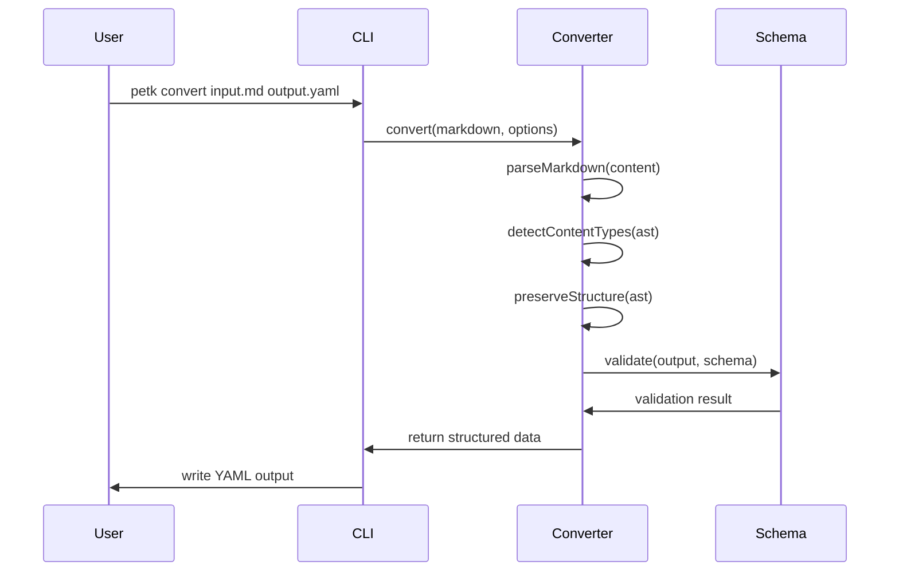

# System Architecture

Understanding Petk's design philosophy, architectural decisions, and system organization. This document explains how the toolkit is structured and why specific technical choices were made.

## Overview

Petk is architected as a modular, extensible toolkit for prompt engineering workflows. The system follows a monorepo structure with clear separation of concerns, enabling both standalone usage and programmatic integration.

## Design Philosophy

### Core Principles

**Modularity First**
Each component serves a specific purpose and can function independently. The CLI, template engine, and converter are separate packages that can be used individually or together.

**Functional Programming Paradigm**
The codebase follows functional programming principles:
- Pure functions without side effects
- Immutable data structures
- Function composition over inheritance
- Declarative code that focuses on *what* rather than *how*

**Developer Experience Focus**
Every architectural decision prioritizes ease of use, clear error messages, and intuitive behavior for prompt engineering workflows.

**Production Ready**
Built for reliability with comprehensive error handling, input validation, and robust edge case management.

## Monorepo Structure

### Repository Organization

```
petk/
├── apps/                    # Applications
│   ├── cli/                # Command-line interface
│   └── docs/               # Documentation site (Docusaurus)
├── packages/               # Shared libraries
│   ├── engine/            # Template processing engine
│   ├── converter/         # Markdown-to-YAML converter
│   ├── utils/             # Shared utilities
│   ├── eslint-config-custom/  # ESLint configuration
│   └── tsconfig/          # TypeScript configurations
└── docs/                  # Project documentation
```

### Package Dependencies



## Core Components

### CLI Application (`apps/cli`)

**Purpose**: Command-line interface providing user-friendly access to all toolkit capabilities.

**Architecture**:
- **Command Pattern**: Each CLI command is implemented as a separate module
- **Commander.js Integration**: Robust argument parsing and help system
- **Error Boundary**: Comprehensive error handling with user-friendly messages

**Key Files**:
- `src/index.ts` - Main CLI entry point and command registration
- `src/commands/` - Individual command implementations
- `src/types.ts` - TypeScript type definitions
- `src/config/` - Configuration management

**Command Implementation Status**:
- ✅ `process` - Fully implemented template processing
- ✅ `convert` - Complete Markdown-to-YAML conversion
- 🚧 `init`, `validate`, `serve` - Planned for future releases

### Template Engine (`packages/engine`)

**Purpose**: Advanced template processing with support for variable substitution, file inclusion, and complex content generation.

**Architecture**:
- **Pipeline Processing**: Multi-stage template processing pipeline
- **AST-Based Parsing**: Structured parsing of template directives
- **Recursive Resolution**: Handles nested includes with cycle detection
- **Extensible Design**: Support for custom directive processors

**Key Components**:
```typescript
// Core processing pipeline
Parser → Block Extractor → Variable Substitution → 
Recursive Resolution → Cycle Detection → Output Generation
```

**Advanced Features**:
- **Glob Pattern Processing**: Complex file selection with sorting options
- **Deterministic Sampling**: Consistent random file selection with seeds
- **Context Management**: Variable scoping and context inheritance
- **Error Recovery**: Robust error handling with detailed diagnostics

### Converter (`packages/converter`)

**Purpose**: Intelligent conversion between Markdown and structured formats (YAML/JSON) with advanced content analysis.

**Architecture**:
- **Multi-Stage Pipeline**: Parse → Analyze → Transform → Validate → Output
- **AST Processing**: Uses marked library for comprehensive Markdown parsing
- **Content Classification**: Intelligent detection of content types
- **Schema Integration**: Optional validation against custom schemas

**Processing Pipeline**:
```typescript
Markdown Input → AST Generation → Content Type Detection → 
Multimodal Analysis → Structure Preservation → Schema Validation → 
Format Generation → Output
```

**Content Detection Capabilities**:
- Text content (headings, paragraphs, emphasis)
- Code blocks with language detection
- Tables with structure preservation
- Lists with nesting support
- Media elements (images, links)
- Frontmatter and metadata

## Technical Stack

### Core Technologies

**Runtime & Language**:
- **Node.js**: Latest LTS for consistent runtime environment
- **TypeScript**: Type safety and modern JavaScript features
- **ESM Modules**: Modern module system for better tree-shaking

**Build & Development**:
- **Turborepo**: Monorepo management and build optimization
- **tsx**: TypeScript execution for development
- **SWC**: Fast TypeScript compilation for production
- **Vitest**: Testing framework with TypeScript support

**Code Quality**:
- **ESLint**: Code quality and consistency enforcement
- **Prettier**: Automated code formatting
- **Functional Programming**: Enforced through ESLint rules

### Key Libraries

**CLI Framework**:
- **Commander.js**: Robust CLI argument parsing and command structure

**Template Processing**:
- **js-yaml**: YAML parsing for configuration and directives
- **glob**: Advanced file pattern matching

**Document Processing**:
- **marked**: Markdown AST parsing and processing

**Utilities**:
- **Custom utilities**: Shared functionality across packages

## Data Flow Architecture

### Template Processing Flow



### Conversion Flow



## Configuration Architecture

### Configuration Hierarchy

```typescript
// Configuration precedence (highest to lowest)
1. CLI arguments (--variable, --config)
2. Environment variables (PETK_*)
3. Project configuration files:
   - petk.config.js
   - petk.config.json
   - .petkrc
   - package.json "petk" field
4. Default values
```

### Configuration Schema

```typescript
interface PetkConfig {
  // Input/output settings
  input: string;
  output: string;
  
  // Processing options
  recursive: boolean;
  include: string[];
  exclude: string[];
  
  // Template engine configuration
  engine: {
    variables: Record<string, any>;
    syntax: 'petk';
    options: EngineOptions;
  };
  
  // Output formatting
  format: {
    type: 'markdown' | 'yaml' | 'json';
    preserveLineBreaks: boolean;
    trimWhitespace: boolean;
  };
}
```

## Error Handling Strategy

### Error Categories

**User Errors**:
- Invalid file paths or missing files
- Malformed template syntax
- Configuration errors
- Schema validation failures

**System Errors**:
- File system access issues
- Memory limitations
- Dependency conflicts
- Runtime exceptions

### Error Recovery Mechanisms

**Template Processing**:
- Cycle detection prevents infinite loops
- Graceful handling of missing includes
- Variable substitution fallbacks
- Context preservation across errors

**Conversion Process**:
- Malformed content recovery strategies
- Schema validation with detailed error messages
- Content type detection fallbacks
- Structure preservation prioritization

## Performance Considerations

### Optimization Strategies

**Template Engine**:
- **Caching**: File content and glob results caching
- **Lazy Evaluation**: Process includes only when needed
- **Memory Management**: Efficient handling of large file sets
- **Parallel Processing**: Concurrent file processing where possible

**Converter**:
- **AST Reuse**: Cache parsed AST for repeated conversions
- **Streaming**: Support for large document processing
- **Memory Optimization**: Efficient handling of complex documents
- **Schema Caching**: Reuse compiled schemas across conversions

### Scalability Design

**Horizontal Scaling**:
- Stateless processing enables parallel execution
- Independent package architecture supports distributed processing
- Configuration-driven batch processing

**Vertical Scaling**:
- Efficient memory usage patterns
- Streaming support for large documents
- Configurable resource limits

## Security Architecture

### Input Validation

**File System Security**:
- Path traversal prevention
- Safe file inclusion patterns
- Restricted file system access

**Template Security**:
- Variable injection prevention
- Safe directive parsing
- Controlled code execution boundaries

**Configuration Security**:
- Schema validation for all configurations
- Environment variable sanitization
- Safe default configurations

### Production Deployment

**Package Security**:
- Minimal dependency footprint
- Regular security auditing
- Signed package releases

**Runtime Security**:
- Input sanitization
- Error message sanitization (no sensitive data exposure)
- Safe temporary file handling

## Future Architecture Considerations

### Planned Enhancements

**Plugin System**:
- Custom directive processors
- Template engine extensions
- Converter format plugins

**Advanced Features**:
- Template compilation for performance
- Advanced caching strategies
- Distributed processing capabilities

**Integration Improvements**:
- IDE extensions
- Build tool integrations
- CI/CD pipeline optimizations

### Extensibility Points

**Template Engine**:
- Custom directive handlers
- Variable resolver plugins
- Output format processors

**Converter**:
- Custom content type detectors
- Format-specific processors
- Schema validator extensions

**CLI Interface**:
- Custom command plugins
- Configuration providers
- Output formatters

This architecture provides a solid foundation for prompt engineering workflows while maintaining flexibility for future enhancements and use cases.